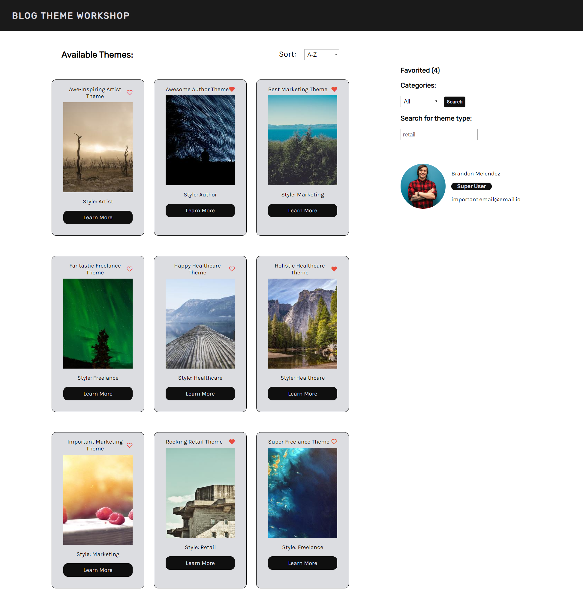
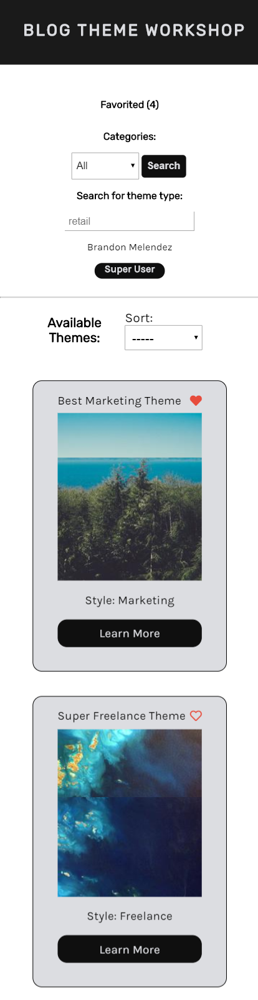

# Blog Theme Workshop

Looking to reimagine your website? Browse through these theme options, you can sort them by industry, keyword, and whether or not you have favorited the theme previously. Click on each theme to read more about it.

## Starting up both servers

To start the backend

```
cd blog-server
```

Create a .env file then modify it to include the DATABASE_URL value with the one that was provided. 

Make sure to install the necessary dependencies by running

```
npm install
```

From inside the **blog-server** run the script:

```
npm start
```

Server is now listening on the provided port, defaulting to 8000

Then change directories to the ../client. Modify the src/config.js file to your backend url and then run

```
npm install
```

Once the necessary dependencies have been installed run 

```
npm start
```

Now your frontend and backend are running and communicating with one another.

Open [http://localhost:3000](http://localhost:3000) to view the project in the browser.

## Built With

- React.JS
- Node.JS
- Express
- MongoDB
- CSS

## Blog Workshop Screenshots

### Full Screen View:



### Mobile Screen View:


