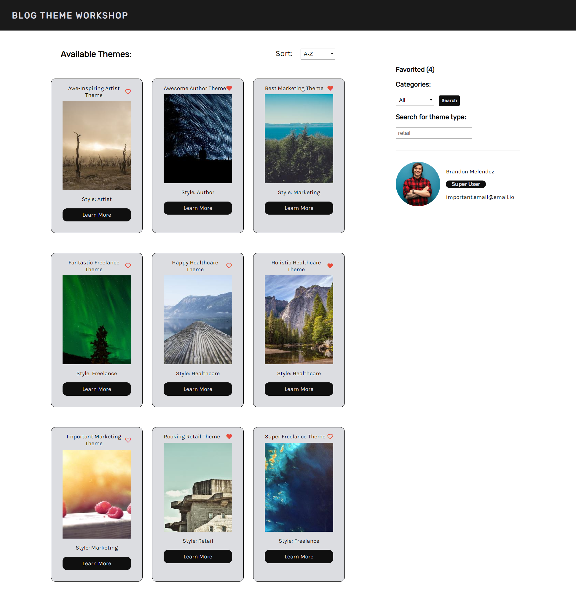
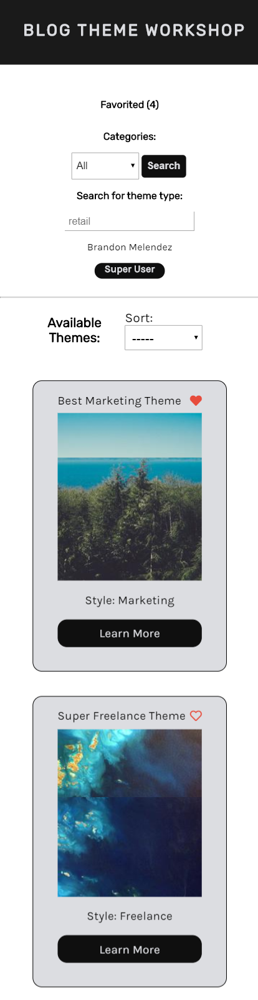

# Blog Theme Workshop

Looking to reimagine your website? Browse through these theme options, you can sort them by industry, keyword, and whether or not you have favorited the theme previously. Click on each theme to read more about it.

## Available Scripts

To run the application, first connect to the database. <br/>

To connect with the database change directories into the **blog-server**: 
```
cd blog-server
```

From inside the **blog-server** run the script:
```
npm start
```
You should now be connected to the database and necessary API endpoints.<br/>

Then change directories to the root folder **Blog-Workshop-App** and run

```
npm start
```

Open [http://localhost:3000](http://localhost:3000) to view the project in the browser.

## Blog Workshop Screenshots

### Full Screen View:



### Mobile Screen View:




## Built With

* React.JS
* Node.JS
* Express
* MongoDB
* CSS